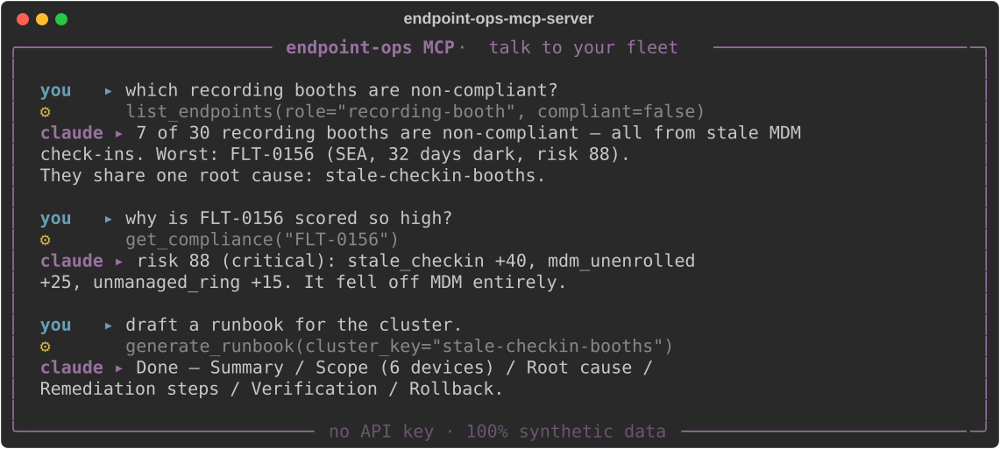
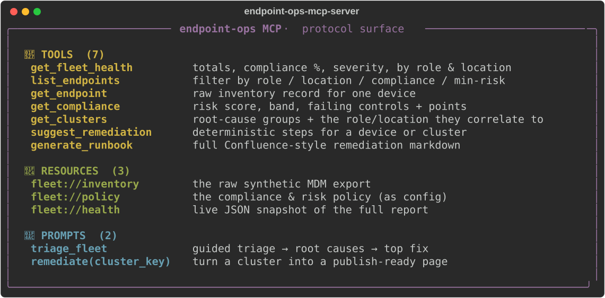
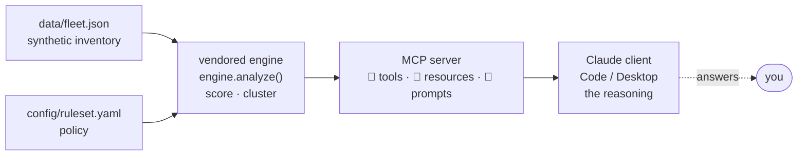

# Endpoint Ops MCP Server

**Talk to a studio endpoint fleet from Claude.** A [Model Context Protocol](https://modelcontextprotocol.io) server that exposes a managed-device fleet as **Tools**, **Resources**, and **Prompts** — so you can ask Claude *"which recording booths are non-compliant, and draft a runbook for the worst one"* and it answers from real (synthetic) inventory instead of guessing.




> Full demo transcript: [`samples/transcript.md`](samples/transcript.md) · Inspector walkthrough: [`samples/inspector.md`](samples/inspector.md)

### The whole protocol surface at a glance



---

## Why this exists

Most "AI portfolio" projects are a chatbot over a generic dataset. This one sits at the intersection of a **real operational domain** — endpoint/fleet management, compliance, patch strategy — and the **frontier of AI tooling**: a protocol-complete MCP server. The hard part of fleet ops isn't calling an LLM; it's the explainable scoring, the root-cause correlation, and the runbook discipline. This server hands all of that to *your* Claude as ground-truth tools. The model reasons; the server never lies about the fleet.

It's the **MCP-native twin** of its sibling CLI, [Fleet Triage AI](../fleet-triage-ai) — same deterministic engine, exposed as a protocol instead of a terminal.

## The no-API-key story (read this first)

An MCP server **is not** an AI app and needs **no Anthropic API key**. It's the *thing Claude connects to*. Your Claude client (Claude Code, Claude Desktop) brings the model; this server just answers tool calls with structured data. So anyone can clone it and run it for free, instantly.

| Layer | What it does | Needs a key? |
| --- | --- | --- |
| **Deterministic engine** (vendored) | Loads a synthetic inventory → scores every device against a YAML policy → clusters at-risk devices by root cause. Pure Python, no network. | **No** |
| **This MCP server** | Exposes the engine as MCP Tools / Resources / Prompts over stdio. | **No** — your Claude client supplies the model. |

## Protocol surface

### 🔧 Tools — what the model calls for ground truth
| Tool | Description |
| --- | --- |
| `get_fleet_health` | Totals, compliance %, severity counts, breakdown by role & location. |
| `list_endpoints` | Filter devices by role / location / compliance / min-risk; highest risk first. |
| `get_endpoint` | The **raw** inventory record for one device (OS, patch level, check-in, owner…). |
| `get_compliance` | The **verdict** for one device: risk score, band, and every failing control with points. |
| `get_clusters` | Root-cause clusters — at-risk devices sharing a dominant fault + the role/location they correlate to. |
| `suggest_remediation` | Concrete, deterministic remediation steps for a device or a cluster. |
| `generate_runbook` | A full Confluence-style remediation runbook (markdown) for a device or cluster. |

### 📄 Resources — context the model can read directly
| URI | Description |
| --- | --- |
| `fleet://inventory` | The raw synthetic fleet inventory (the MDM export the engine scores). |
| `fleet://policy` | The compliance & risk policy as config — lets the model explain *why* a device scored as it did. |
| `fleet://health` | A JSON snapshot of the full fleet report; pin it into context to start a triage session. |

### 💬 Prompts — one-click workflows
| Prompt | Description |
| --- | --- |
| `triage_fleet` | Guided triage: summarize health → surface root causes → recommend the highest-leverage fix. |
| `remediate(cluster_key)` | Turn a root-cause cluster into a publish-ready remediation page. |

## Setup

```bash
git clone https://github.com/jmlkin/endpoint-ops-mcp-server
cd endpoint-ops-mcp-server
pip install -e .
```

### Claude Code (one command)

```bash
claude mcp add endpoint-ops -- endpoint-ops-mcp
```

Then just ask: *"Use the endpoint-ops triage_fleet prompt"* or *"which edit-bays have encryption off?"*

### Claude Desktop

Add to `claude_desktop_config.json` (Settings → Developer → Edit Config):

```json
{
  "mcpServers": {
    "endpoint-ops": {
      "command": "endpoint-ops-mcp"
    }
  }
}
```

Restart Claude Desktop; the 🔧 tools, 📄 resources, and 💬 prompts appear in the MCP menu.

### MCP Inspector (great for screenshots)

```bash
mcp dev src/endpoint_ops_mcp/server.py
```

Opens a local web UI to browse and invoke every tool, resource, and prompt — no Claude client needed.

## Point it at your own fleet

The server reads its data and policy from env vars, so it adapts to any inventory and any org baseline (CIS, internal hardening standard, …) without code changes:

```bash
ENDPOINT_OPS_DATA=/path/to/fleet.json \
ENDPOINT_OPS_RULESET=/path/to/ruleset.yaml \
endpoint-ops-mcp
```

The bundled fleet is **100% synthetic** (200 devices, deterministic seed `1337`, `FLT-*` ids, `synthetic-user-*` owners) — no real systems or people. Safe to run, fork, and demo.

## Develop

```bash
pip install -e ".[dev]"
pytest
```

## Architecture



One deterministic seam (`fleet.engine.analyze`) feeds every tool, so the inventory, the verdicts, and the runbooks can never disagree. The model sits *on top* of that ground truth — it queries the fleet, it doesn't invent it.

> Deeper dive — layers, the single-seam rule, determinism: [`docs/architecture.md`](docs/architecture.md).

## License

MIT © 2026 Jose Milan. Built as an open, synthetic-data showcase of endpoint operations × modern AI tooling.
