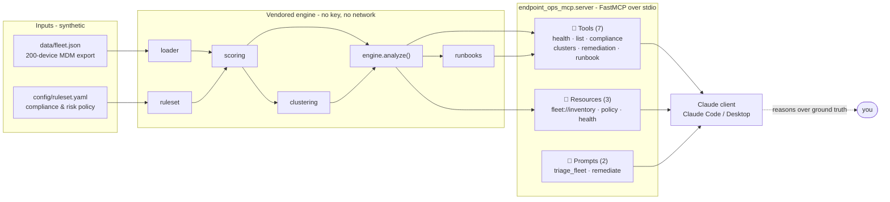

# Architecture

The server is a thin, protocol-shaped adapter over a deterministic fleet-health
engine. The engine is the source of truth; the Model Context Protocol layer just
exposes it. The connected Claude client supplies the reasoning — **no API key, no
network calls from the server.**



## The one rule

`fleet.engine.analyze(FleetData, Ruleset) -> FleetReport` is the **single public
seam**. Every tool, every resource, and the JSON snapshot all derive from it, so the
inventory the model reads, the verdicts it quotes, and the runbooks it drafts can
never disagree. There is no second scoring path to drift out of sync.

## Why there's no API key

An MCP server is not an AI app. It speaks the Model Context Protocol over stdio and
returns structured data. The **client** (Claude Code, Claude Desktop) is what holds
the model and decides which tools to call. So this process never authenticates to
any AI provider — it just answers tool calls. That is the entire reason anyone can
clone it and run it for free.

## Dependency direction (enforced by imports)

- `endpoint_ops_mcp.fleet.*` (the vendored core) imports only the standard library
  and `pyyaml`. It never imports `mcp`.
- `endpoint_ops_mcp.server` imports the core **plus** `mcp` (FastMCP) and adds the
  protocol surface on top. Nothing in the core depends on the server.

## Determinism

The bundled fleet is generated with `random.Random(1337)` and plants *correlated*
faults (patch drift on render-nodes, encryption-off on one location's edit-bays,
stale recording-booths), so clustering surfaces story-shaped findings and
`data/fleet.json` is byte-reproducible. The engine takes its `as_of` timestamp from
the data file, not the wall clock, so staleness math — and therefore every score —
is stable over time.

## Point it at your own fleet

Both inputs are swappable without touching code:

```bash
ENDPOINT_OPS_DATA=/path/to/fleet.json \
ENDPOINT_OPS_RULESET=/path/to/ruleset.yaml \
endpoint-ops-mcp
```
